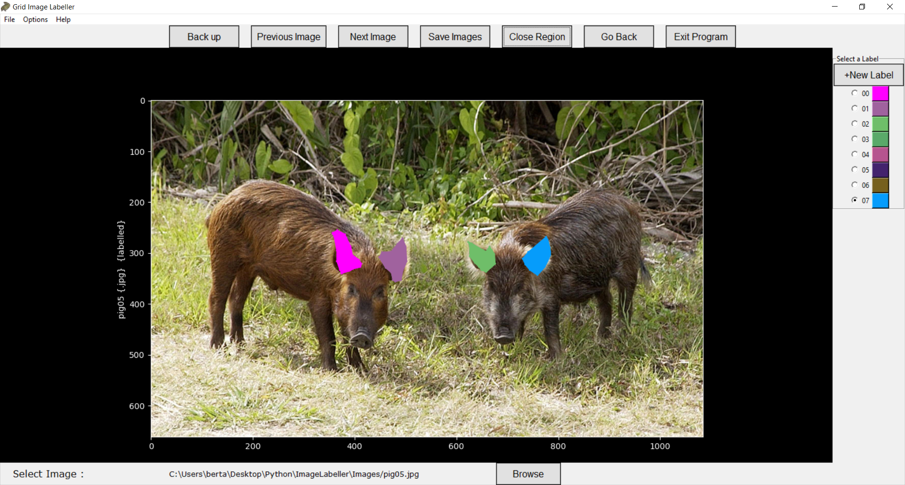

# Python Image Labelling GUI

Table of contents
-----------------

* [Introduction](#introduction)
* [Usage](#usage)
* [Requirements and Installation](#requirements-and-installation)
* [Intro Screen](#into-screen)
* [Grid Cell Labelling](#grid-cell-labelling)
* [Bounding Box Labelling](#bounding-box-labelling)
* [Polygon Labelling](#polygon-labelling)
* [FAQ](#faq)

Introduction
------------

A GUI made in Python that can label all images in a folder with different coloured labels. The program supports bounding box labelling, polygon labelling and individual grid-cell labelling.

**Python Image Labeller**

* Uses callback events from Matplotlib to label images
* Labels can be saved in .json format or in csv format. In the case of generic region labelling, labels can be saved as new images.
* Supports multiple labels to be added to images with custom colours
* Allows user to label all images stored in one particular folder
* Options to adjust colour and size of measurement grid
