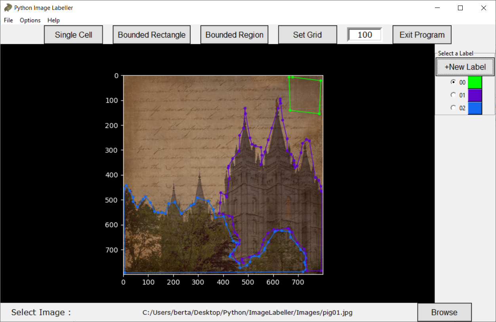
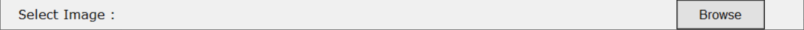

# Python Image Labelling GUI

Table of contents
-----------------

* [Introduction](#introduction)
* [Requirements and Installation](#requirements-and-installation)
* [Intro Screen](#introduction-screen)
* [Grid Cell Labelling](#grid-cell-labelling)
* [Bounding Box Labelling](#bounding-box-labelling)
* [Polygon Labelling](#polygon-labelling)

Introduction
------------

A GUI made in Python that can label all images in a folder with different coloured labels. The program supports bounding box labelling, polygon labelling and individual grid-cell labelling.

**Python Image Labeller**

* Uses callback events from Matplotlib to label images
* Labels can be saved in `.json` format. In the case of generic region labelling, labels can be saved as new images.
* Supports multiple labels to be added to images with custom colours
* Allows user to label all images stored in one particular folder
* Options to adjust colour and size of measurement grid#

Requirements and Installation
-----------------------------

The following packages are required and were tested with the following versions:

* Matplotlib version 3.2.1
* keyboard version 0.13.4

Clone the repository into a folder and run `Image Labeller.py` in a Python kernel. I.e. `python ImageLabeller.py` in the command line.

Introduction Screen
-------------------

The intro screen can be used to load an image for labelling. Click on the `Browse` button in the bottom right corner.

Select an image the file explorer. You need to select an image in order to start labelling so that previous labels in the folder can be loaded.
 

After you have selected the image that you want to label. Select a button on the top bar to select a method for labelling.

The size of the measurement grid can also be set on this top bar.

Grid Cell Labelling
-------------------

Grid cell labelling will turn the image into a discrete set of square grid cells. Each label can be applied to a grid cell. Left click on the image to change the label of a grid cell and right click to undo the last cell that was labelled. If you want to hide the grid you can click on `options` and set to grid width to `0 px`.

To added more labels using the menu on the right. Click the `+New Label` button to add another label colour. When a new label colour is added it will be available to all images in the current folder.

Click on `options` on the very top bar to change the cursor colour to another colour to change the colour of the current label which is being used. You can set your own custom colour by clicking on `Custom` and entring the colour in hex format e.g. `#FFFFFF` corresponds to white. Search for 'Color Picker' on the internet to select a particular colour.

Bounding Box Labelling
----------------------

Bounding boxes is the fasted way of labelling and has several advantages from a deep learning classification perspective as well. From the into screen, click on the `Bounded Rectangle` button in order to label an image using bounding boxes.

Each bounding box is defined by clicking two points to define the bounding box. The first click will draw a point and the second will draw a transparent rectangle. The opacity can be controlled by going on `options` and then selecting a percentage of opacity. Now more than two points can exist for a single label colour.

Use the top bar to navigate to the next image in the folder. When you click `Back up`, you save the label in `.json` format in the current folder containing the images.

Backing up is automatic when you go to the next image or the previous image. You can also select a different image from the same folder using the `Browse` button in the bottom right corner.

Polygon Labelling
-----------------

Polygon labelling involves labelling regions by specifing each point. This kind of labelling takes longer to do but can give more granular labelling.

To label a region, simply select the label colour and left click to specify points. To remove points in the order they were added right click on the image window. The top bar has some different buttons. As well as storing points in `.json` format, the labels be saved as images. The file extension will be save the same as the original image extension. Clicking on the `Close Region` button will fill in the shape made by the points in the region.

