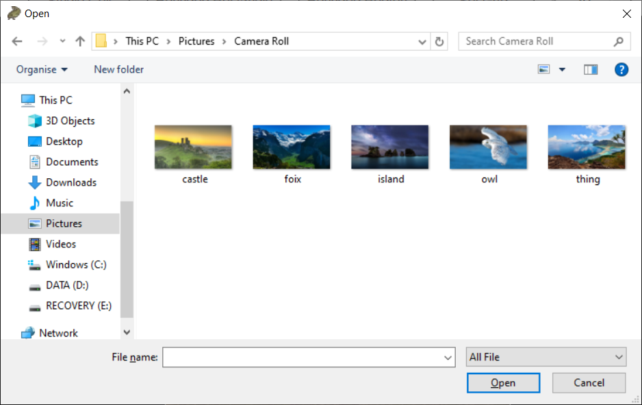

# Python Image Labelling GUI

Table of contents
-----------------

* [Introduction](#introduction)
* [Requirements and Installation](#requirements-and-installation)
* [Intro Screen](#into-screen)
* [Grid Cell Labelling](#grid-cell-labelling)
* [Bounding Box Labelling](#bounding-box-labelling)
* [Polygon Labelling](#polygon-labelling)
* [FAQ](#faq)

Introduction
------------

A GUI made in Python that can label all images in a folder with different coloured labels. The program supports bounding box labelling, polygon labelling and individual grid-cell labelling.

**Python Image Labeller**

* Uses callback events from Matplotlib to label images
* Labels can be saved in .json format or in csv format. In the case of generic region labelling, labels can be saved as new images.
* Supports multiple labels to be added to images with custom colours
* Allows user to label all images stored in one particular folder
* Options to adjust colour and size of measurement grid#

Requirements and Installation
-----------------------------

The following packages are required and were tested with the following versions:

* Matplotlib version 3.2.1
* keyboard 0.13.4

Clone the repository into a folder and run `Image Labeller.py` in a Python kernel. I.e. `python ImageLabeller.py` in the command line.

Intro Screen
------------

The intro screen can be used to load an image for labelling. Click on the `Browse` button in the bottom right corner.

Select an image the file explorer. You need to select an image in order to start labelling so that previous labels in the folder can be loaded.
 

After you have selected the image that you want to label. Select a button on the top bar to select a method for labelling.

The size of the measurement grid can also be set on this top bar.

Grid Cell Labelling
-------------------

Grid cell labelling will turn the image into a discrete set of square grid cells. Each label can be applied to a grid cell. Left click on the image to label a grid cell and right click to undo the last cell that was labelled. If you want to hide the grid you can click on `options` and set to grid width to `0 px`.

To added more labels using the menu on the right. Click the `+New Label` button to add another label colour. When a new label colour is added it will be available to all images in the current folder.

Click on `options` on the very top bar to change the cursor colour to another colour to change the colour of the current label which is being used.

